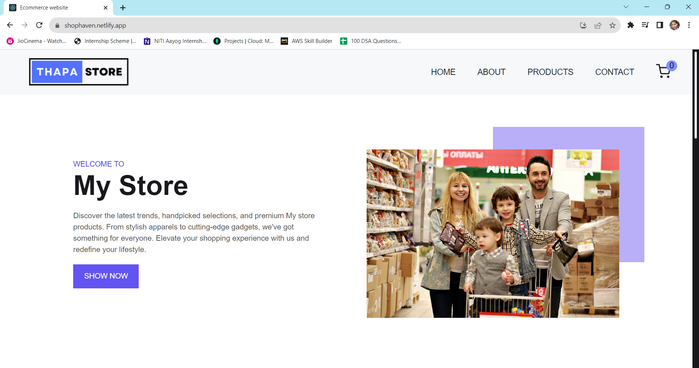
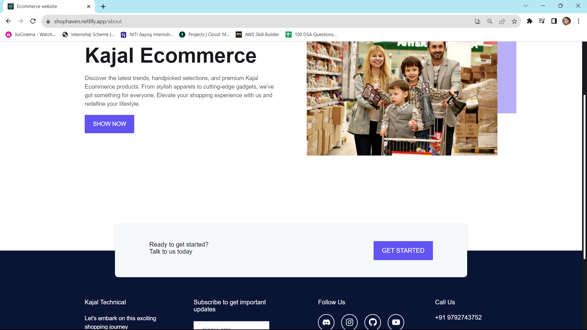
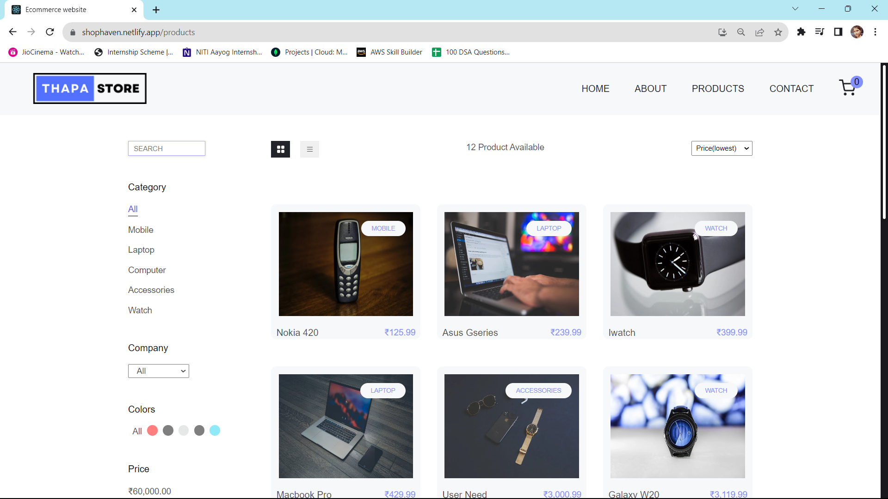
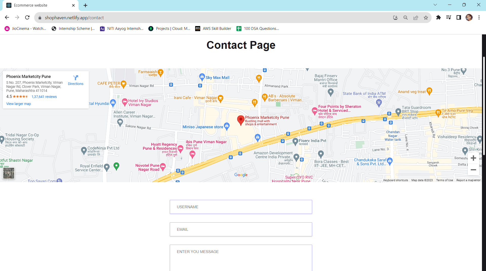
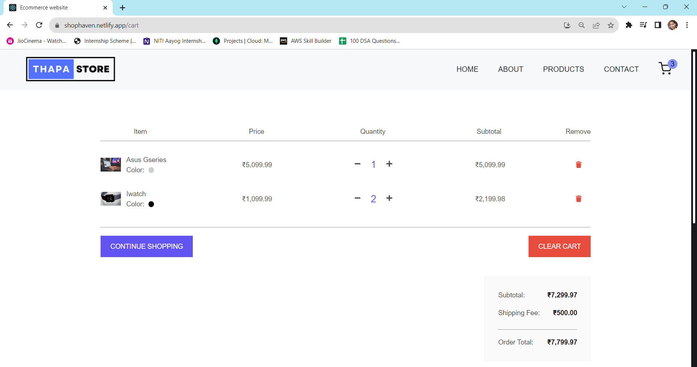

# totalitycorp-frontend-challenge

# About:

This is an e-commerce shophaven website is a digital platform that allows businesses to sell products and services to customers over the Internet. These websites are incredibly popular because of their convenience and accessibility.

Welcome to our premier e-commerce shopping website, where shopping becomes an immersive and effortless experience. Our platform brings together a diverse range of products from various categories, all easily accessible at your fingertips.

## Screenshots

# Deployment link:
https://shophaven.netlify.app/

## Connect with Us

Let's connect on LinkedIn:

- [Kajal Pandey 🙎‍♀️](https://www.linkedin.com/in/kajal-pandey-08b312260/)

